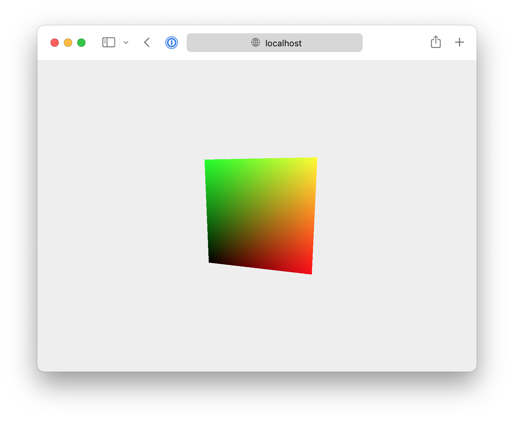

# Tree.js template
_Gilbert François Duivesteijn_

Special thanks to the original author _Yuri Artiukh_.

## About

This template is a minimum starting point for a Three.js web project.




## Parcel

Parcel is a web application bundler, differentiated by its developer experience. To install parcel, if you don't have it yet, type:

```sh
npm install -g parcel-bundler
```

Then, start the webserver with:

```sh
parcer index.html
```

Or use another build system that you prefer.
